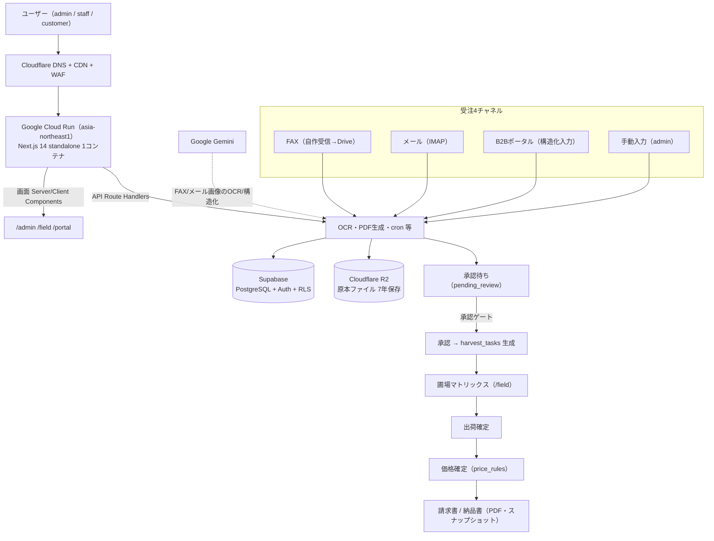

# 小島農園 受注・圃場・請求アプリ（kojima-noen）

紙のFAX・メール・電話に散らばっていた農産物の受注を一本化し、**受注 → 検証 → 圃場（収穫・出荷）→ 請求**までを
1つの画面でつなぐ、小島農園のための業務アプリです。Google Cloud Run 上の Next.js 一体型で動きます。

> 設計の中心思想：**「OCRが必要なのは紙とメール画像だけ」**。B2Bポータルと手動入力は最初から構造化データなので
> AIを通しません。これが Gemini 無料枠の枯渇対策の核であり、ポータルが普及するほどコストが下がります。

---

## 目次

- [何ができるか](#何ができるか)
- [画面構成（3つのサーフェス）](#画面構成3つのサーフェス)
- [ホーム画面（管理ダッシュボード）](#ホーム画面管理ダッシュボード)
- [写真からマスタ一括取込（OCR）](#写真からマスタ一括取込ocr)
- [技術スタック / アーキテクチャ](#技術スタック--アーキテクチャ)
- [主要機能とデータフロー](#主要機能とデータフロー)
- [DBスキーマ概観](#dbスキーマ概観)
- [ディレクトリ構成](#ディレクトリ構成)
- [セットアップ（ローカル開発）](#セットアップローカル開発)
- [環境変数・シークレット](#環境変数シークレット)
- [よく使うコマンド](#よく使うコマンド)
- [デプロイ（Cloud Run）](#デプロイcloud-run)
- [設計上の重要ルール（要約）](#設計上の重要ルール要約)
- [セキュリティ方針](#セキュリティ方針)
- [テスト](#テスト)

---

## 何ができるか

| 業務フェーズ | 機能 |
|---|---|
| **受注** | 4チャネル受信（FAX→Drive / メール IMAP / B2Bポータル / 手動入力）→ Gemini解析 → 承認待ちキュー |
| **検証** | 確信度ハイライト・差分（再送）検知・取引先名寄せ・承認・Undo（楽観ロック付き） |
| **圃場** | 圃場マトリックス（タップループ安全版・部分完了・不足アラート・オフラインoutbox） |
| **請求** | 出荷確定 → 価格確定（後決め）→ 請求書（インボイス対応・欠番なし採番）・納品書 PDF |
| **マスタ** | 取引先・品目・価格/荷姿（P/C・換算）管理、**写真からの一括取込（OCR）** |
| **設定** | 自社情報・規格ロック・現場機能の段階解放・AIモデル・取り込み・通知（Discord/LINE WORKS）など |

金額・税率・請求番号は `.claude/rules/tax.md` のルールを厳守（税率冗長保持・GENERATED列・Decimal.js・欠番なし採番）。

---

## 画面構成（3つのサーフェス）

| サーフェス | ルート | 対象 | 特徴 |
|---|---|---|---|
| 管理（経営） | `/admin` | 経営陣 | 高密度・俯瞰。サイドバーは業務フェーズでグルーピング |
| 現場（スタッフ） | `/field` | 現場 | スマホ/タブレット最優先。タップ操作・大きいターゲット |
| B2Bポータル | `/portal` | 取引先 | Magic Link 認証・「いつものセット」・RLSで自社分のみ |

---

## ホーム画面（管理ダッシュボード）

`/admin` を開くと最初に表示される、その日の経営判断の起点になる画面です（[app/(dashboard)/admin/page.tsx](app/(dashboard)/admin/page.tsx)）。
上から **「今日の状況」→「いま手を打つこと」→「次の操作」** の順に、視線が自然に流れるよう構成しています。

1. **ヘッダー**：「ダッシュボード」見出しと、右上の常設ボタン **［注文を新規入力］**（電話注文などをその場で入力）。

2. **本日の出荷状況**（KPIカード4枚・当日 `delivery_date` 基準で集計）
   - **未着手** / **梱包完了**（青）/ **出荷済み**（緑）の件数
   - **進捗 %**（出荷済み ÷ 全明細）をプログレスバー付きで表示
   - 明細があれば「出荷一覧で詳細確認 →」で当日の現場画面へ

3. **要対応**（該当があるときだけ赤バッジ付きで出現）
   - **承認待ちの注文** → 承認すると収穫タスクを生成（`/admin/approvals`）
   - **未処理の受信** → AI解析済み・要確認の受信ログ（`/admin/inbox`）
   - **解析失敗 / 取引先未紐付け** → 手動で確認・紐付け（`/admin/inbox?status=ai_failed`）
   - 0件のときはこのセクション自体を出さず、ノイズを減らします。

4. **よく使う操作**：注文の新規入力 / 取引先・規格管理 / 請求書 へのショートカット。

> 設計意図：朝イチで開いたとき「今日どれだけ出るか」「放置してはいけないものは何か」が一目で分かり、
> 次のアクションにワンタップで移れること。数値は等幅数字（tabular-nums）で桁を揃え、色だけでなくアイコン＋
> テキストで状態を伝えています（WCAG AA）。

---

## 写真からマスタ一括取込（OCR）

紙の取引先一覧・品目台帳・規格表を**撮影するだけ**で、店舗（取引先）・品目・規格/荷姿をまとめて登録できます
（管理者専用 `/admin/master-import`）。受注明細OCRとは独立した専用モジュールです。

```
写真を選ぶ(最大6枚) → AIで読み取る → 確認・編集（重複は折りたたみ）→ チェックした分だけ登録
```

- **AI**：Gemini を生 `fetch` で呼び、`responseSchema` + `temperature:0` で構造化抽出。
  設定の **AIモデル** を最優先に、混雑(429/503)・未提供(404)時のみ新→古の順で自動フォールバック。
- **取り込み前圧縮**：ブラウザ側で最大1600px / JPEG品質0.8に圧縮してから送信（通信量・トークン節約）。
- **重複判定（名寄せ）**：NFKC正規化＋空白除去＋小文字化で、表記ゆれ（全角半角・かな/カナ）を吸収。
  既存マスタと重複しそうなものは **チェックOFF＋折りたたみ**、新規は **チェックON＋展開** で提示。
- **Human-in-the-loop**：全項目その場で編集可。確信度60%未満は ⚠要確認 を明示。各セクションに「すべて選択/解除」。
- **安全に登録**：品目 → 規格（必要なら品目を自動作成）→ 取引先 の順。ユニーク制約違反はスキップ扱い、
  想定外エラーは全体を止めず `errors[]` に記録して継続（部分登録の混乱を防止）。

関連：[lib/gemini/master-import.ts](lib/gemini/master-import.ts) / [lib/master-import/dedupe.ts](lib/master-import/dedupe.ts) /
[components/admin/MasterImportWizard.tsx](components/admin/MasterImportWizard.tsx)

---

## 技術スタック / アーキテクチャ



- **フレームワーク**：Next.js 14（App Router・`output:'standalone'`）/ TypeScript strict
- **DB/認証**：Supabase（`@supabase/supabase-js` は **2.47.10 固定**。最新系は型が壊れるため上げない）
- **データ取得**：@tanstack/react-query 5 / フォーム react-hook-form 7 + zod 3
- **計算**：decimal.js（金額・税は浮動小数点禁止）/ 日付 date-fns 3
- **UI**：Tailwind（CSS Variables・デザイントークン）/ lucide-react / recharts / react-hot-toast
- **AI**：Gemini（受注OCRは SDK、マスタ一括取込は生fetch+responseSchema）
- **PDF**：@react-pdf/renderer（Route Handler 内）

### 主要パッケージ（package.json 実値）

| 用途 | パッケージ | バージョン |
|---|---|---|
| フレームワーク | `next` | ^14.2.20 |
| DB/Auth | `@supabase/supabase-js` | 2.47.10（固定） |
| DB/Auth | `@supabase/ssr` | 0.5.2（固定） |
| データ取得 | `@tanstack/react-query` | ^5.62.7 |
| テーブル | `@tanstack/react-table` | ^8.20.5 |
| フォーム | `react-hook-form` | ^7.54.1 |
| バリデーション | `zod` | ^3.24.1 |
| 金額計算 | `decimal.js` | ^10.4.3 |
| 日付 | `date-fns` | ^3.6.0 |
| PDF | `@react-pdf/renderer` | ^4.1.0 |
| AI | `@google/generative-ai` | ^0.21.0 |
| メール取込 | `imapflow` / `mailparser` | ^1.0.171 / ^3.7.1 |
| R2 (S3互換) | `@aws-sdk/client-s3` | ^3.700.0 |
| 画像処理 | `sharp` | ^0.35.2 |
| オフライン | `idb` | ^8.0.0 |
| テスト | `vitest` | ^2.1.8 |

詳細は `.claude/rules/`（stack.md / structure.md / security.md / design.md / features.md / tax.md）を参照。

---

## 主要機能とデータフロー

受注ボックス → 承認ゲート → 出荷一覧 → 価格確定 → 請求、という一本のパイプラインが核。

| フェーズ | 画面 | 主要API / lib | 関連テーブル |
|---|---|---|---|
| 受注（受信） | `/admin/inbox`, `/admin/approvals`（統合済み「受注ボックス」） | `app/api/receipts/**`, `lib/ingestion/`, `lib/gemini/` | `order_receipts`, `orders`, `order_items` |
| 承認ゲート | `/admin/approvals` | `app/api/orders/[id]/approve/route.ts` → `lib/orders/approve.ts` | `orders`, `delivery_destinations`, `pack_configs` |
| 圃場（収穫） | `/field/matrix` | `lib/field/`, `harvest_tasks` 生成ロジック | `harvest_tasks`, `order_items` |
| 出荷 | `/field/shipments`, `/admin/deliveries` | `app/api/shipments/**`, `app/api/deliveries/confirm` | `deliveries`, `delivery_events`, `lots` |
| 帳票 | `/field/print`, `/admin/delivery-notes` | `app/api/shipping-docs/**`, `app/api/print-jobs` | `print_jobs`, `delivery_notes` |
| 価格確定 | `/admin/pricing`, `/admin/pricing-master` | `lib/pricing/` | `price_rules`, `pack_configs` |
| 請求 | `/admin/invoices` | `lib/calculations/tax.ts`（Decimal.js） | `invoices`, `invoice_items`, `invoice_counters` |
| ポータル受注 | `/portal/order` | `app/api/portal/**` | `orders`（`source='portal'`） |

詳細な業務フロー（4チャネル・スマートパース・タップループ等）は [.claude/rules/features.md](.claude/rules/features.md)。

---

## DBスキーマ概観

マイグレーションは `migrations/*.sql` に連番で追加（ORM 無し・手書きSQL）。追加したら本番Supabase
にも忘れず適用し、`types/database.ts` を手動で追従させる（`supabase gen types` は未導入）。

| テーブル | 役割 |
|---|---|
| `users` | 社内ユーザー（admin/staff）とロール |
| `customers` | 取引先マスタ（`channel_identifiers` でFAX/メール等の識別子を保持） |
| `delivery_destinations` | 取引先の納入先（1取引先に複数ありうる。表示は必ず「取引先＞納入先」） |
| `products` | 品目マスタ |
| `pack_configs` | 荷姿マスタ（総数→箱数の換算基準・作業指示） |
| `price_rules` | 価格マスタ（期間×取引先の単価。過去実績には遡及しない） |
| `orders` / `order_items` | 受注ヘッダー・明細（`order_items.version` で楽観ロック） |
| `order_receipts` | 受信の生ログ（チャネル横断の重複・再送判定の中核） |
| `harvest_tasks` | 圃場への収穫・出荷タスク（承認時に生成） |
| `deliveries` / `delivery_events` / `lots` | 配送状態遷移・イベント記録・ロット管理 |
| `invoices` / `invoice_items` / `invoice_counters` | 請求書（発行時点のスナップショット・欠番なし採番） |
| `delivery_notes` / `delivery_note_items` | 納品書（同じくスナップショット） |
| `print_jobs` | 帳票印刷キュー（事務所自動印刷） |
| `spec_reports` | 規格レポート |
| `audit_log` | 変更履歴（Undo の基盤にもなる） |

---

## ディレクトリ構成

```
app/
  (auth)/login/                 ログイン（社内=password / ポータル=Magic Link）
  (dashboard)/
    admin/                      経営サーフェス（ダッシュボード・承認・請求・マスタ・設定…）
    field/                      現場サーフェス（出荷一覧・圃場マトリックス）
  portal/                       B2Bポータル（取引先）
  api/                          Route Handlers（OCR・差分・PDF・cron・各CRUD）
components/  ui/ admin/ field/ layouts/ …
lib/         supabase/(client/server/admin)  gemini/  calculations/  pricing/
             master-import/  settings(-spec).ts  notify/  validators/ …
migrations/  DDL（基盤10テーブル + 受注4テーブル + RLS + 生成列）
types/       database.ts（Zod）/ supabase.ts（手書き Database 型）
Dockerfile / .dockerignore / next.config.js
```

---

## セットアップ（ローカル開発）

> ⚠️ **重要**：このリポジトリは Google ドライブ上にあり、ドライブ直下では `npm install` / `build` / `lint` が
> ファイルロック等で失敗します。**ローカルにクローンして検証してください**（例：`C:\dev\kojima-noen`）。

```bash
git clone https://github.com/naioki/Kojima-Farm-Shipping-Management-App.git
cd Kojima-Farm-Shipping-Management-App
npm ci
cp .env.example .env.local   # 値を埋める（なければ下記キーを手で作成）
npm run dev                   # http://localhost:3000
```

---

## 環境変数・シークレット

秘密情報は **コードに直書きせず**、本番は **Secret Manager**、ローカルは `.env.local` に置きます。

```
# 公開可
NEXT_PUBLIC_SUPABASE_URL
NEXT_PUBLIC_SUPABASE_ANON_KEY

# サーバ専用（秘密）
SUPABASE_SERVICE_ROLE_KEY
R2_ENDPOINT / R2_BUCKET / R2_ACCESS_KEY_ID / R2_SECRET_ACCESS_KEY
GEMINI_API_KEY
CRON_SECRET
DISCORD_WEBHOOK_URL / LINE_WORKS_WEBHOOK_URL
```

多くの設定は **設定画面（`/admin/settings`）からDBに保存**でき、解決は「DB → 環境変数」の順
（[lib/settings.ts](lib/settings.ts) / [lib/settings-spec.ts](lib/settings-spec.ts)）。
APIキーなど `secret` 指定の項目は、画面では値を返さず「設定済み/未設定」だけ表示します。
**AIモデル**は設定画面のプルダウンから選択でき、「自動」で新しいモデルから順に試します。

---

## よく使うコマンド

```bash
npm run dev          # 開発サーバ
npm run build        # 本番ビルド（standalone）
npm run lint         # ESLint（CIは --max-warnings=0）
npx tsc --noEmit     # 型チェック
npx vitest run       # ユニットテスト
```

---

## デプロイ（Cloud Run）

```bash
gcloud run deploy kojima-noen \
  --source . \
  --region asia-northeast1 \
  --memory 1Gi --cpu 1 \
  --min-instances 0 --max-instances 3 \
  --allow-unauthenticated \
  --set-secrets "SUPABASE_SERVICE_ROLE_KEY=supabase-key:latest,GEMINI_API_KEY=gemini-key:latest"
```

- リポジトリルートの `Dockerfile`（マルチステージ・node:20-slim・非root `USER node`）でビルドします。
- タイムアウトは既定300秒（請求書一括生成・OCRも余裕）。シークレットは必ず Secret Manager 経由で。
- 取り込み cron（Drive/メール）は Cloud Scheduler から OIDC + `CRON_SECRET` で呼び出します。
- **`git push` だけでは本番に反映されません**（デプロイトリガー未設定）。手順とスクリプトは
  [DEPLOY.md](DEPLOY.md) を参照。デプロイ後は必ずトラフィックが **`--to-latest`** になっているか
  確認すること（過去に特定リビジョン固定が残り、新デプロイが反映されない事故があったため）。

---

## 設計上の重要ルール（要約）

実装前に必ず目を通すべきルール。詳細は各リンク先（`.claude/rules/`）。

| ルール | 概要 | 詳細 |
|---|---|---|
| 取引先＞納入先表示 | 一覧・詳細・帳票のどこでも「取引先＞納入先」で表示。納入先単独は出さない | [features.md](.claude/rules/features.md) |
| 承認ゲート | 納品日・納入先・荷姿が未確定だと承認不可（出荷一覧到達時点で計算可能を保証） | [app/api/orders/[id]/approve/route.ts](app/api/orders/%5Bid%5D/approve/route.ts) |
| 楽観ロック | `order_items.version` で `WHERE id=$ AND version=$expected`。0件は409で再読込を促す | CLAUDE.md |
| スナップショット凍結 | `invoices`・`delivery_notes` は発行時点の内容を別テーブルへ複製。元データ変更の影響を受けない | [tax.md](.claude/rules/tax.md) |
| 税率・金額計算 | `order_items.tax_rate`（注文時確定値）を使用。浮動小数点禁止・Decimal.js 必須 | [tax.md](.claude/rules/tax.md) |
| エラー握りつぶし禁止 | 一覧・詳細ページはエラー時に必ず `<ErrorState>`、空状態は必ず `<EmptyState>` | CLAUDE.md |

---

## セキュリティ方針

- 全テーブルに **RLS** を有効化。新テーブルはポリシーも同時作成。
- すべての Route Handler で **Zod バリデーション** ＋ `getUser()` 認証チェック（`getSession` 単独は信用しない）。
- `service_role` キーは **`lib/supabase/admin.ts` のみ**。`'use client'` から import 禁止。
- Gemini APIキーは URL クエリではなく `x-goog-api-key` ヘッダで送信（ログ漏洩防止）。
- セキュリティヘッダー（`X-Content-Type-Options` / `X-Frame-Options` / HSTS）は middleware で付与。

詳細は [.claude/rules/security.md](.claude/rules/security.md)。

---

## テスト

判定・計算の核は純粋関数に切り出し、ユニットテストで固定しています
（スマートパース・税計算・名寄せ・重複判定・Undo・タップループ・不足・通知・出荷指示・オフラインなど）。

```bash
npx vitest run     # 全テスト
```

> 誤解釈が出荷ミス・請求ミスに直結するため、`lib/calculations/parse-quantity.ts` 等は変更時にテスト必須です。
